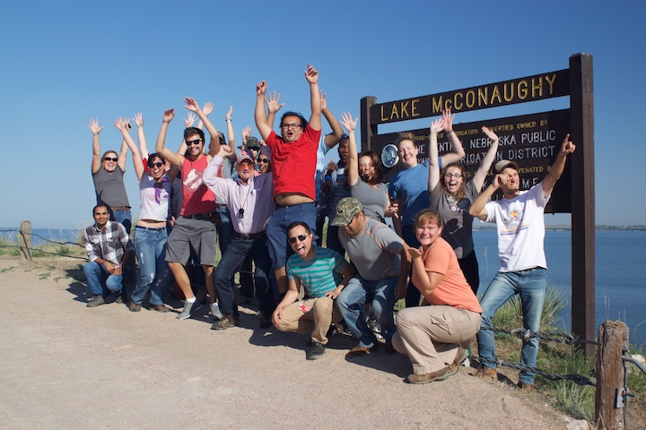

 

{.custom_image .grow .shadow}

### Ecology & Management of Plant Pathogens 
#### *PLPT802 is offered every Spring semester*

This is a graduate level course offered every spring on the biology, development, spread, and management of plant diseases, their causal agents and how environmental factors interact with diseases. The course is 3 credit hours and is required for students in the Plant Pathology degree specializations and the Doctor of Plant Health. Course format is a mixture of lectures, discussions, and student presentations. At right is a picture from one of our class exercises, where students turned epidemiology manuscripts into infographics!

 

{.custom_image .grow .shadow}

### Disease Dynamics & Evolution
#### *Taught in spring 2016 and offered on demand*

This course was designed to cover core concepts of disease ecology and pathogen emergence and evolution for undergraduates in the Microbiology program. Concepts were organism-agnostic and important for understanding infectious diseases of humans, animals, and plants. The goal of this course is to use interesting and intriguing case studies of infectious diseases to develop critical thinking as scientists. The course was designed to be appropriate for a wide variety of biology students, with interests in ecology, environmental biology, animal, plant, and human biology to microbiology, pre-vet and pre-med.  During the 2015-2016 academic year, I comprehensively reviewed this course while participating in the UNL Peer Review of Teaching program and used that information to develop a Benchmark Teaching Portfolio[^1]. This portfolio is <a href="http://digitalcommons.unl.edu/prtunl/20"> published online</a> on the UNL Digital Commons.  

 

### Intro. to R for Population Genetics and Epidemiology
This course introduces students to the R programming language, with applications in population genetics and epidemiology. This course was offered in the summer of 2016 as a blended workshop / short-course. Students were taught basic skills in R syntax, data types (logical, character, numeric, etc.), data structures, sub-scripting, plotting, and packages. The goal of this course was to give students, faculty, staff, and postdocs, enough skills in R that they can access packages and resources of interest to each of them for their own research. 

  

### Success in the Sciences
#### *Taught in Summer of 2018*

This course was co-developed with graduate students in order to best meet the needs of today's students. Various topics are covered using active learning techniques in the classroom. Upon completion of this course students  acquired skills and confidence to navigate a path to success in graduate school and feel more prepared to take the next step after graduation. Specific skills taught and topics covered include: using your resources (brains not brawn), critical evaluation of the primary literature, project management, optimizing your time, mentoring and being mentored, the protocols and pitfalls of publishing, presenting your science, the art of communicating your work, tips for communicating with colleagues, networking to get a job, and the job interview. Course format includes lectures, various out-of-class assignments, group discussion, peer evaluations, presentations, and reading the primary literature. 

 

### Disease Tour Across Nebraska
This course is taught by Dr. Tamra Jackson-Ziems and I was a co-instructor in 2016 and 2017. Below are our group photos from the 2016 trip across Nebraska.

 

 

[^1]: Everhart, Sydney E., <a href="http://digitalcommons.unl.edu/prtunl/20"> "PLPT 496/892: Disease Dynamics & Evolution—A Peer Review of Teaching Project Benchmark Portfolio"</a> (2016). UNL Faculty Course Portfolios. 20.
