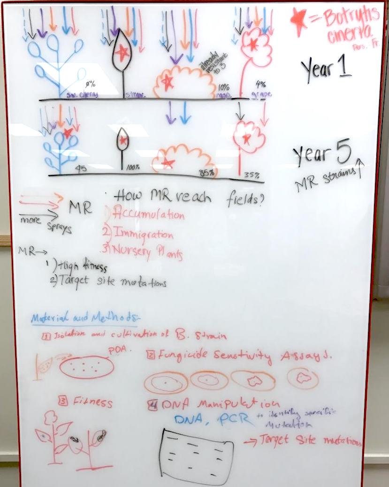
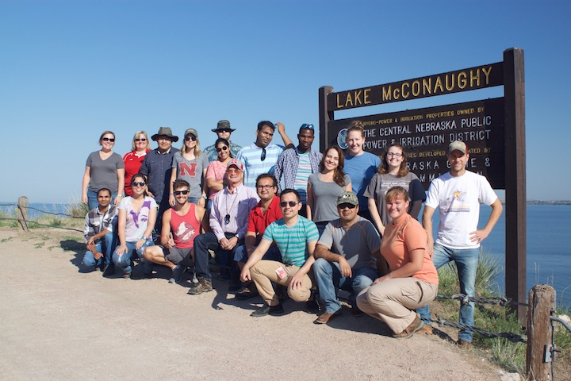

 

### Ecology & Management of Plant Pathogens 

This is a graduate level course offered every spring on the biology, development, spread, and management of plant diseases, their causal agents and how environmental factors interact with diseases. The course is 3 credit hours and is required for students in the Plant Pathology degree specializations and the Doctor of Plant Health. Course format is a mixture of lectures, discussions, and student presentations. At right is a picture from one of our class exercises, where students turned epidemiology manuscripts into infographics!

 

### Disease Dynamics & Evolution 
This course was designed to cover core concepts of disease ecology and pathogen emergence and evolution for undergraduates in the Microbiology program. Concepts were organism-agnostic and important for understanding infectious diseases of humans, animals, and plants. The goal of this course is to use interesting and intriguing case studies of infectious diseases to develop critical thinking as scientists. The course was designed to be appropriate for a wide variety of biology students, with interests in ecology, environmental biology, animal, plant, and human biology to microbiology, pre-vet and pre-med.  

 

### Intro. to R for Population Genetics and Epidemiology
This course introduces students to the R programming language, with applications in population genetics and epidemiology. This course was offered in the summer of 2016 as a blended workshop / short-course. Students were taught basic skills in R syntax, data types (logical, character, numeric, etc.), data structures, sub-scripting, plotting, and packages. The goal of this course was to give students, faculty, staff, and postdocs, enough skills in R that they can access packages and resources of interest to each of them for their own research. 

  

### Population Genetics and Epidemiology
This course is being developed and will be offered in the Fall of 2018. More information coming soon!

 

### Disease Tour Across Nebraska
This course is taught by Dr. Tamra Jackson-Ziems and I was a co-instructor in 2016 and 2017. Below are our group photos from the 2016 trip across Nebraska.

 

 

