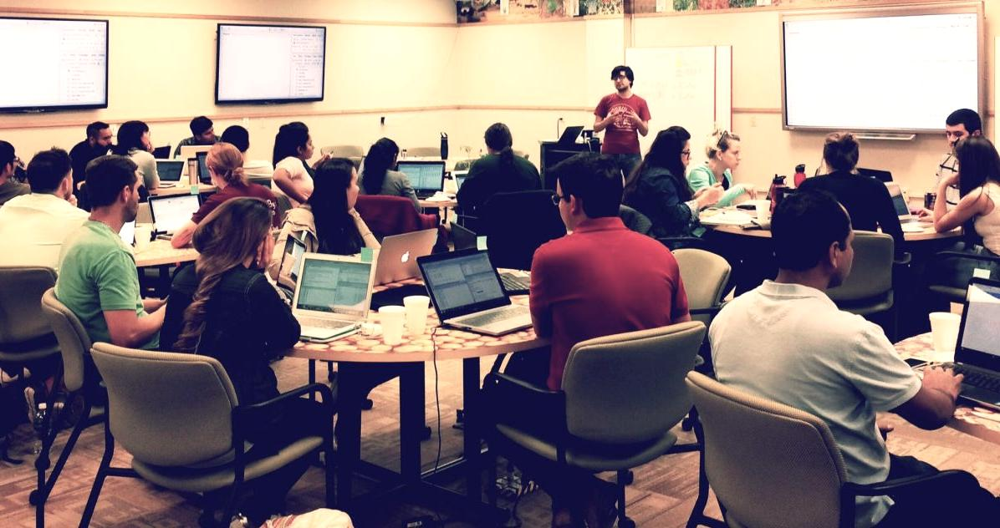

In my lab, we characterize population dynamics and spread of fungal plant pathogens using quantitative spatiotemporal epidemiology, population genetics, and whole-genome approaches. We also study how pathogens evolve under stress and how this is related to emergence of fungicide resistance.

 

## News from the Lab

  

### November 2017
- Our population study of *Sclerotinia sclerotiorum* populations is now accepted for publication in *PeerJ*!  Congratulations to Zhian *et al.* on this publication!
- New undergraduate students, Audrey Vega and Isabel Chavez, are selected to join the Everhart Lab as new lab helpers.  Welcome, Audrey and Isabel!
- The USDA Women and Minorities in Agricultural STEM program will be funding a project that I co-developed with collaborators Jenny Keshwani, Leah Sandall, Julie Obermyer, and Deepak Keshwani, to create a mentoring program for youth to connect with career professionals who look like them.  Our program is called *Cultivate ACCESS* and will be launched in the spring of 2018!

#### October 2017
- Invited by Dr. Anne Dorrance, I taught our Intro to R for Plant Pathologists workshop to ~20 grad students and postdocs located in Wooster and video-linked to Columbus.  The following day, I gave a seminar for the department and had a great time meeting students, faculty, and staff.
- Our manuscript on the largest population genetic study of *Sclerotinia sclerotiorum* that were collected over a 10-year period is now out as a *PeerJ Preprints* and under review at *PeerJ*.
- Jimin Kamvar has joined the Department of Plant Pathology to serve as a *Digital Communications Liaison*. Her work will me keep the department website much more timely and updated.  Welcome, Jimin!

#### September 2017

- I was invited by Dr. Mark Gleason to give a seminar at the Department of Plant Pathology and Microbiology at Iowa State University.
- Nikita was selected to receive the 2017-2018 Widaman Distinguished Graduate Assistantship. Congratulations, Nikita!

#### August 2017

- Invited by Drs. Eduardo Mizubuti and David Jaccoud Filho, I gave two presentations at the 16th International Sclerotinia Workshop in Uberlandia, Brazil. This also included a post-meeting field trip to see agricultural production in the region and my first visit to a coffee plantation (with rust!!).
- Edgar, Zhian, Thomas, Nikita, and I are headed to the national APS meeting in San Antonio, TX.  Check out our posters if you're there.
- Nikita received the Donald E. Munnecke Student Travel Award from APS to attend the national meeting.  Well done!

#### July 2017

- Farewell to Anthony as he departs the Everhart Lab to begin graduate studies in microbiology at the University of Iowa.  Good luck, Anthony!
- Welcome to Alex Johnson!  Starting in July, Alex will be working in our lab half time as a research assistant.

#### June 2017

- Edgar, Anthony, and Nikita each received a travel award to attend the North Central APS meeting in Champaigne, IL.  Congratulations on your excellent poster presentations!
- Our Intro to R Workshop, co-taught with Dr. Alex Lipka of Univ. of Illinois at Urbana-Champaigne, was a big success at the 2017 North Central APS Meeting.  We had more than 20 people coding in R.
- Welcome to Dr. Margarita Marroquin-Guzman!  Starting June 6th, Margarita will be working in our lab as a postdoctoral scholar on a project to characterize the soybean / covercrop microbiomes with different covercrop rotations.  Welcome!

#### May 2017

- Intro to R Workshop co-developed and taught by myself and Zhian was delivered to a packed house of more than 50 people from UNL. Photo at right shows Zhian teaching a classroom of captivated graduate students, postdocs, and faculty in the Goodding Learning Center.

#### April 2017

- Nikita wins award for her poster presented at the UNL Spring Research Fair -- congratulations, Nikita!
- Edgar, Nikita, and Anthony presented posters at the UNL Spring 2017 Research Fair (Edgar, right)

#### March 2017

- We submitted three abstracts for the 2017 national APS meeting in San Antonio, TX

#### February 2017

- Collaborative paper by Madeline Dowline of Guido Schnabel's lab was published in *Pest Management Science* on development of markers for *Monilinia fructicola* isolate tracking within lesions. Congratulations, Madeline!

#### January 2017

- Dr. Zhian Kamvar joins the Everhart Lab as postdoc to work with genomes and genetic data.  Welcome!
- Thomas' manuscript on the effect of irrigation level for optimal chemigation control of *Sclerotinia sclerotiorum* is now available  online and will appear in April 2017 issue of Crop Protection. Sydney Everhart at National Sclerotinia Initiative
- Professor Everhart presents our research at the National Sclerotinia Initiative meeting in Minneapolis (right).

 

### News from 2016

#### December 2016

- Our paper now published and shows sublethal fungicides alter mutation rates and potentially alters genomes: http://dx.doi.org/10.1371/journal.pone.0168079
- Best of luck to undergraduate students Morgan and Josh as they pursue opportunities more closely related to their future careers.

#### November 2016

- Sajeewa's manuscript accepted to PLOS ONE
- First departmental seminar by Nikita Gambhir entitled "Fungicide Sensitivity: Comparisons of Methods in a Model Plant Pathogen"

#### September 2016

- Submitted Thomas Miroini's manuscript on chemigation and white mold control to Crop Protection -- cross your fingers!
- Group photo taken (L to R): Everhart Lab in the Fall 2016: Anthony Pannullo, Thomas Miorini, Nikita Gambhir, Josh Hanson, Morgan Thompsen, Edgar Nieto, and Sydney Everhart

#### August 2016

- Edgar Nieto-Lopez receives a fellowship from CONACyT Mexico to support his research on *Sclerotinia sclerotiorum* from the U.S. and Mexico.  He arrived at UNL this fall to begin doctoral studies. Welcome, Edgar!
- Thank you, APS, for the Schroth Faces of the Future Award!  This award provided funds for travel to the national meeting to give a in the Schroth Symposium at the APS national meeting.

#### June 2016

- Nikita Gambhir (second from left below) wins third place for her poster presented at the North Central Division APS meeting in Minneapolis and awarded a travel award to go there.  Double-win!

#### May 2016

- Anthony Pannullo awarded IANR ARD Undergraduate Student Research Award for his proposal entitled "Population genetic diversity of *Sclerotinia sclerotiorum*, causal agent of white mold disease of dry bean, and implications for fungicide resistance / disease management."