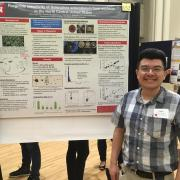

We characterize population dynamics and spread of fungal plant pathogens using quantitative spatiotemporal epidemiology, population genetics, and whole-genome approaches. We also study how pathogens evolve under stress and how this is related emergence of fungicide resistance.

 

## News from the Lab

  

#### October 2017

- Our manuscript on the largest population genetic study of Sclerotinia sclerotiorum that were collected over a 10-year period is now out as a PeerJ Preprint and under review at PeerJ.

#### September 2017

- Invited by Dr. Mark Gleason, Sydney gives a seminar at the Department of Plant Pathology and Microbiology at Iowa State University.
- Nikita selected to receive the 2017-2018 Widaman Distinguished Graduate Assistantship. Congratulations, Nikita!

#### August 2017

- Invited by Drs. Eduardo Mizubuti and David Jaccoud Filho, Sydney gives two presentations at the 16th International Sclerotinia Workshop in Uberlandia, Brazil. This also included a post-meeting field trip to see agricultural production in the region and first visit to a coffee plantation (with rust!!).
- Nikita awarded the 2017-2018 Widaman Distinguished Graduate Assistantship from UNL. Congratulations, Nikita!
- Edgar, Zhian, Thomas, Nikita, and Sydney are heading to the national APS meeting in San Antonio.  Check out our posters if you're there.
- Nikita received the Donald E. Munnecke Student Travel Award from APS to attend the national meeting.

#### July 2017

- Farewell to Anthony as he departs the Everhart Lab to begin graduate studies in microbiology at the University of Iowa.  Good luck, Anthony!
- Welcome to Alex Johnson!  Starting in July, Alex will be working in our lab half time as a research assistant.

#### June 2017

- Anthony, Nikita, and Edgar each received a travel award to attend the North Central APS meeting in Champaigne.  Congratulations on your excellent poster presentations!North Central APS Intro to R Workshop
- Our Intro to R Workshop, co-taught with Dr. Alex Lipka of Univ. of Illinois at Urbana-Champaigne, was a big success at the 2017 North Central APS Meeting.  We had more than 20 people coding in R.
- Welcome to Dr. Margarita Marroquin-Guzman!  Starting June 6th, Margarita will be working in our lab as a postdoctoral scholar on a project to characterize the soybean / covercrop microbiomes with different covercrop rotations.  Welcome!

#### May 2017

- Intro to R Workshop co-developed and taught by Sydney and Zhian to a packed house of more than 50 people from UNL. Photo at right shows Zhian teaching a classroom of captivated graduate students, postdocs, and faculty in the Goodding Learning Center.

#### April 2017

- Nikita wins award for her poster presented at the UNL Spring Research Fair -- congratulations, Nikita!Edgar Nieto Lopez at UNL Spring Research Fair 2017
- Edgar, Nikita, and Anthony presented posters at the UNL Spring 2017 Research Fair (Edgar, right)

#### March 2017

- Three abstracts submitted for the 2017 national APS meeting in San Antonio, TX

#### February 2017

- Collaborative paper with Guido Schnabel's lab published in Pest Management Science on development of markers for Monilinia fructicola isolate tracking

#### January 2017

- Dr. Zhian Kamvar joins the Everhart Lab as postdoc to work with genomes and genetic data.  Welcome!
- Thomas' manuscript on the effect of irrigation level for optimal chemigation control of S. sclerotiorum now online and will appear in April 2017 issue of Crop Protection. Sydney Everhart at National Sclerotinia Initiative
- Professor Everhart presents our research at the National Sclerotinia Initiative meeting in Minneapolis (right).

 

### News from 2016

#### December 2016

- Our paper now published and shows sublethal fungicides alter mutation rates and potentially alters genomes: http://dx.doi.org/10.1371/journal.pone.0168079
- Best of luck to undergraduate students Morgan and Josh as they pursue opportunities more closely related to their future careers.

#### November 2016

- Sajeewa's manuscript accepted to PLOS ONE
- First departmental seminar by Nikita Gambhir entitled "Fungicide Sensitivity: Comparisons of Methods in a Model Plant Pathogen"

#### September 2016

- Submitted Thomas Miroini's manuscript on chemigation and white mold control to Crop Protection -- cross your fingers!
- Group photo taken (L to R): Everhart Lab from Fall 2016Anthony Pannullo, Thomas Miorini, Nikita Gambhir, Josh Hanson, Morgan Thompsen, Edgar Nieto, and Sydney Everhart

#### August 2016

- Edgar Nieto-Lopez awarded a prestigious CONACyT fellowship from Mexico and arrives at UNL to begin doctoral studies
- Professor Everhart gives presentation as part of the APS Schroth Faces of the Future Symposium at the national meeting

#### June 2016

- Nikita Gambhir (second from left below) wins third place for her poster presented at the North Central Division APS meeting in Minneapolis and awarded a travel award to go there.  Double-win!

#### May 2016

- Anthony Pannullo awarded IANR ARD Undergraduate Student Research Award for his proposal entitled "Population genetic diversity of Sclerotinia sclerotiorum, causal agent of white mold disease of dry bean, and implications for fungicide resistance / disease management."