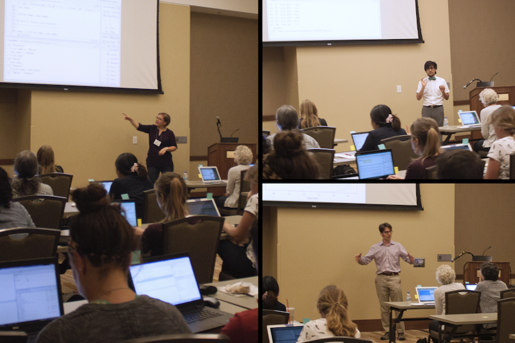

In my lab, we characterize population dynamics and spread of fungal plant pathogens using quantitative spatiotemporal epidemiology, population genetics, and whole-genome approaches. We also study how pathogens evolve under stress and how this is related to emergence of fungicide resistance.

 

## News from the Lab

 

### News from 2018

#### January 2018

{.custom_image .shadow .grow}

- Becky Higgins of Jim Steadman's lab and Zhian (pictured right) have their poster ready for the National Sclerotinia Initiative meeting this Wednesday, January 17th in Minneapolis, MN. 
- Collaborative paper with Dr. Amauri Bogo of Santa Catarina State University in Brazil on two species of *Neofabraea* causing apple bull's-eye rot is is now in press and available as a pre-print online!  https://doi.org/10.1080/07060661.2017.1421588

  

### News from 2017

#### December 2017

{.custom_image .shadow .grow}

- Paper in *PeerJ* now published! Check it out. https://peerj.com/articles/4152/  

- We submitted a total of five abstracts for the APS-ICPP 2018 meeting, including recent work by Thomas to compare ability of different fungicides to protect flowers from infection by *Sclerotinia sclerotiorum* ascospores (pictured right). 

- I was nominated by Dr. Loren Giesler for the UNL Dinsdale Family Faculty Award for pre-tenure faculty with excellence in research, teaching, and/or extension. It was a great opportunity to get my photo taken with both Loren and our IANR Vice Chancellor and plant pathologist, Dr. Mike Boehm.

{.custom_image .shadow .grow}

#### November 2017

 - Our population study of *Sclerotinia sclerotiorum* populations is now accepted for publication in *PeerJ*!  Congratulations to Zhian *et al.* on this publication!

 - New undergraduate students, Audrey Vega and Isabel Chavez, are selected to join the Everhart Lab as new lab helpers.  Welcome, Audrey and Isabel!
 
 - The USDA Women and Minorities in Agricultural STEM program will be funding a project that I co-developed with collaborators Jenny Keshwani, Leah Sandall, Julie Obermyer, and Deepak Keshwani, to create a mentoring program for youth to connect with career professionals who look like them.  Our program is called *Cultivate ACCESS* and will be launched in the spring of 2018!
 
We hosted two visiting speakers this month:

{.custom_image .shadow .grow}

- Dr. Jerry Weiland of the USDA-ARS Horticultural Crops Research Unit visited our department and gave a comprehensive talk on characterization of soilborne pathogens that affect tree production in the Pacific Northwest. This talk was highly praised by many in our department!

{.custom_image .shadow .grow}

+ Dr. Stacy Krueger-Hadvield from the University of Alabama at Birmingham visited and give us an exciting talk on the mysterious lives of marine algae. Belive it or not, plant pathogens and algae have a lot in common when it comes to population genetics! Complex mating systems == complex data. Great talk!

#### October 2017

{.custom_image .shadow .grow}

- Invited by Dr. Anne Dorrance, I taught our Intro to R for Plant Pathologists workshop to ~20 grad students and postdocs located in Wooster and video-linked to Columbus.  The following day, I gave a seminar for the department and had a great time meeting students, faculty, and staff.

- Our manuscript on the largest population genetic study of *Sclerotinia sclerotiorum* that were collected over a 10-year period is now out as a *PeerJ Preprints* and under review at *PeerJ*.

- Jimin Kamvar has joined the Department of Plant Pathology to serve as a *Digital Communications Liaison*. Her work will me keep the department website much more timely and updated.  Welcome, Jimin!

#### September 2017

- I was invited by Dr. Mark Gleason to give a seminar at the Department of Plant Pathology and Microbiology at Iowa State University.

- Nikita was selected to receive the 2017-2018 Widaman Distinguished Graduate Assistantship. Congratulations, Nikita!

#### August 2017

{.custom_image .shadow .grow}

- Invited by Drs. Eduardo Mizubuti and David Jaccoud Filho, I gave two presentations at the 16th International Sclerotinia Workshop in Uberlandia, Brazil. This also included a post-meeting field trip to see agricultural production in the region and my first visit to a coffee plantation (with rust!!).

- Edgar, Zhian, Thomas, Nikita, and I are headed to the national APS meeting in San Antonio, TX.  Check out our posters if you're there.

- Nikita received the Donald E. Munnecke Student Travel Award from APS to attend the national meeting.  Well done!

{.custom_image .shadow .grow}

#### July 2017

- Farewell to Anthony as he departs the Everhart Lab to begin graduate studies in microbiology at the University of Iowa.  Good luck, Anthony!

- Welcome to Alex Johnson!  Starting in July, Alex will be working in our lab half time as a research assistant.

#### June 2017

{.custom_wide .shadow .grow}

- Edgar, Anthony, and Nikita each received a travel award to attend the North Central APS meeting in Champaigne, IL.  Congratulations on your excellent poster presentations!

- Our Intro to R Workshop, co-taught with Dr. Alex Lipka of Univ. of Illinois at Urbana-Champaigne, was a big success at the 2017 North Central APS Meeting.  We had more than 20 people coding in R.

- Welcome to Dr. Margarita Marroquin-Guzman!  Starting June 6th, Margarita will be working in our lab as a postdoctoral scholar on a project to characterize the soybean / covercrop microbiomes with different covercrop rotations.  Welcome!

{.custom_wide .shadow .grow}

#### May 2017

- Intro to R Workshop co-developed and taught by myself and Zhian was delivered to a packed house of more than 50 people from UNL. Photo at right shows Zhian teaching a classroom of captivated graduate students, postdocs, and faculty in the Goodding Learning Center.

#### April 2017

{.custom_image .shadow .grow}

- Nikita wins award for her poster presented at the UNL Spring Research Fair -- congratulations, Nikita!

- Edgar, Nikita, and Anthony presented posters at the UNL Spring 2017 Research Fair (Edgar, right)

#### March 2017

- We submitted three abstracts for the 2017 national APS meeting in San Antonio, TX

#### February 2017

- Collaborative paper by Madeline Dowline of Guido Schnabel's lab was published in *Pest Management Science* on development of markers for *Monilinia fructicola* isolate tracking within lesions. Congratulations, Madeline!

#### January 2017

- Dr. Zhian Kamvar joins the Everhart Lab as postdoc to work with genomes and genetic data.  Welcome!

{.custom_image .shadow .grow}

- Thomas' manuscript on the effect of irrigation level for optimal chemigation control of *Sclerotinia sclerotiorum* is now available  online and will appear in April 2017 issue of Crop Protection. Sydney Everhart at National Sclerotinia Initiative

- I gave a presentation of our research at the National Sclerotinia Initiative meeting in Minneapolis (right).

 

### News from 2016

#### December 2016

- Our paper now published and shows sublethal fungicides alter mutation rates and potentially alters genomes: http://dx.doi.org/10.1371/journal.pone.0168079

- Best of luck to undergraduate students Morgan and Josh as they pursue opportunities more closely related to their future careers.

#### November 2016

- Sajeewa's manuscript accepted to PLOS ONE

- First departmental seminar by Nikita Gambhir entitled "Fungicide Sensitivity: Comparisons of Methods in a Model Plant Pathogen"

{.custom_wide .shadow .grow}

#### September 2016

- Submitted Thomas Miroini's manuscript on chemigation and white mold control to Crop Protection -- cross your fingers!

- Group photo taken (L to R): Everhart Lab in the Fall 2016: Anthony Pannullo, Thomas Miorini, Nikita Gambhir, Josh Hanson, Morgan Thompsen, Edgar Nieto, and Sydney Everhart

#### August 2016

- Edgar Nieto-Lopez receives a fellowship from CONACyT Mexico to support his research on *Sclerotinia sclerotiorum* from the U.S. and Mexico.  He arrived at UNL this fall to begin doctoral studies. Welcome, Edgar!

{.grow .custom_image .shadow}

- Thank you, APS, for the Schroth Faces of the Future Award!  This award provided funds for travel to the national meeting to give a in the Schroth Symposium at the APS national meeting. This is also where I got to meet up with former graduate colleagues, Lucky Mehra (K-State) and Brijesh Karakkat (UW).

#### June 2016

"){.custom_wide .shadow .grow}

- Nikita Gambhir wins third place for her poster presented at the North Central Division APS meeting in Minneapolis and awarded a travel award to go there.  Double-win!

#### May 2016

- Anthony Pannullo awarded IANR ARD Undergraduate Student Research Award for his proposal entitled "Population genetic diversity of *Sclerotinia sclerotiorum*, causal agent of white mold disease of dry bean, and implications for fungicide resistance / disease management."

#### January 2016

- Submitted two new proposals to the NSB to study soil microbial communities and a collaborative proposal with the Giesler lab to study *Sclerotinia sclerotiorum*

- Submitted a proposal with the Jackson-Ziems lab to gain new knowledge of fungal foliar pathogens of corn

 

### News from 2015

#### November 2015

- I traveled to St. Louis to meet and give a presentation for the NCSPR seedling disease project

#### October 2015

- Funding was awarded for one of our proposals submitted to the NSB and both of our proposals submitted to the NCSRP!

#### May 2015 

- Submitted two proposals to the North Central Soybean Research Program for funding to support our work studying the emergence and evolution of fungicide resistance in *Sclerotinia sclerotiorum* and to study *Rhizoctonia solani* as an important seedling pathogen in Nebraska

#### January 2015

- Submitted two proposals to the Nebraska Soybean Board requesting funding to support graduate student research on *Rhizoctonia solani* and *Sclerotinia sclerotiorum*

 

### News from 2014

#### October 2014 

{.custom_image .shadow .grow}

- I gave a presentation on work in my lab as part of an NSF-funded meeting to discuss development of the Center for Emergence, Evolution, and Management of Pesticide Resistance (CEEMPR), which would establish a university-industry partnership

#### September 2014

- Welcome to Sarah Campbell (pictured right) and Josh Hanson, joining the lab as undergraduate lab assistants to work on the sub-lethal fungicide sensitivity project

{.custom_image .shadow .grow}

#### August 2014 

- B. Sajeewa Amaradasa joins my lab as the first postdoc hired. 

 
 
 

---

## Lab inception

- Door to 435 Plant Sciences Hall opens as the Everhart lab on August 18, 2014!  

{.custom_center .shadow}
 

*Let the fun begin!*

