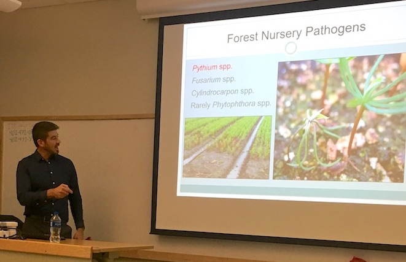
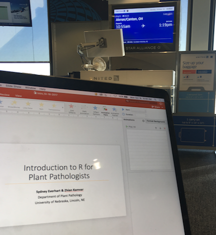
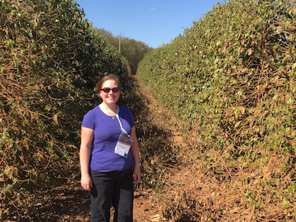

In my lab, we characterize population dynamics and spread of fungal plant pathogens using quantitative spatiotemporal epidemiology, population genetics, and whole-genome approaches. We also study how pathogens evolve under stress and how this is related to emergence of fungicide resistance.

 

## News from the Lab

 

### News from 2019

#### August 2019
  - After 5 years at the University of Nebraska, I will be starting this fall semester as an associate professor in the Department of Plant Pathology. To the best of my knowledge, I am the third woman to be hired and promoted in the department in the 100 year history, following the footsteps of Drs. Anne Vidaver and Tamra Jackson-Ziems. For those who may be on the tenure track and wondering what a tenure package looks like, you are welcome to <a href="documents/Everhart_PnT_Dossier_12-21-2018.pdf">view mine here.</a>
  - Several of the Everhart Lab members traveled to the APS Meeting in Cleveland, OH to present our research. Karen presented two talks, including one in the Melhus Symposium. Margarita presented two posters (although I had to present one on her behalf because of the time conflict). Nikita presented two posters and co-taught our Intro R workshop. Srikanth presented a poster of his research.  Thomas presented a poster of previous work in my lab and even Edgar had a poster at the meeting, which I presented on his behalf. In general, we made our visit to Ohio very productive, forming new relationships, extending our networks, and identifying future potential collaborations. 
  - Congratulations to Karen!  She received the third place oral presentation from the North Central Division and was the only student from our department selected for the NC-APS travel award. Way to go!
  - A big welcome to new Everhart Lab member, Mr. Sergio Gabriel-Peralta!  Sergio received his bachelor's in Mexico and his master's at UNL studying viruses. He joins the lab after having been awarded a prestigious CONNACYT fellowship from the Mexican government.  Welcome, Sergio!
  
#### July 2019
  - Congratulations, Julianne, for successfully defending your dissertation!  I heard lots of great comments about the quality of your presentation.
  - Julianne was awarded the Corteva Award to attend the Society of Nematology (SON) Meeting in Raleigh, NC this month.  She gave an oral presentation of her research on nematodes in the Great Smoky Mountains National Park and presented a poster of her work on deciphering ecological features within cryptic species, *Mesocriconema xenoplax*.
  - The beginning of this month was the conclusion of a summer course that I taught on professional development called *Success in the Sciences*. This has become a highly rated course and so I will be teaching it again this fall.
  - In other news, Ms. Asha Mane is joiing the Everhart Lab this month.  Asha received her bachelor's and master's in India and is interested in cutting-edge research in plant pathology. She also comes to us after having several years of lab experience. We will be working together this fall to develop her project plans. Welcome, Asha!

#### June 2019
  - I traveled with Complex Biosystems students, Kimberly Stanke and Ashley Stengel, to Idaho to present a poster and for them to give talks at the North American Colleges and Teachers of Agriculture meeting in Twin Falls, ID. Congratulations on two very excellent presentations on pedagogy!

#### April 2019
  - We have two new people joining the Everhart Lab this month, Mr. Srikanth Kodati and Ms. Gulcin Ercan.  Both students previously worked with Dr. Tony Adesemoye who left UNL for an industry position this month. Srikanth will move to Lincoln later this spring and Gulcin will finish her master's in North Platte, under direct supervision of her co-advisor, Dr. Julie Peterson. Welcome, Sri and Gulcin!

#### March 2019
  - The Everhart Lab hosted Dr. Lucky Mehra, epidemiologist and instructor from Kansas State University to give a seminar and co-teach the Intro to R workshop during the spring break to more than 60 students, staff, and faculty.  
  - Nikita and I traveled to Knoxville, TN to the University of Tennessee for a joint collaborative visit with Drs. Denita Hadziabdic and Meg Staton. We kicked off a week-long visit by teaching our Intro R workshop and then later, Nikita worked with the Staton lab to learn de novo genome assembly and I worked one-on-one in a data analysis project with Denita. 
  - Good news!  I returned from Tennessee to find out that my application for tenure and promotion were officially approved at all of the levels from the department to the Vice Chancellor.

#### February 2019
  - The UNL Teaching and Learning Symposium was held this month at Innovation Campus. As part of the event, I co-taught a workshop on active learning techniques that were used in my professional development course. The great thing was that I got to co-teach this with two graduate students who co-developed the course, Kimberly Stanke and Ashley Stengel. I think we did a great job and had fun!

#### January 2019
  - Biochemistry undergraduate, Cristian Wolkup-Gil, has joined our lab to gain research experience. He's writing proposals for  a UCARE project and an IANR Undergraduate Research Award to conduct a project on fungicide sensitivity of *Sclerotinia sclerotiorum* from dry bean fields in the U.S. 
  = The project that I started as part of my USDA-NIFA Postdoctoral fellowship on *Phytophthora ramorum* was published in *mBio* this month. 
  - As part of my application for tenure, I delivered a seminar in the Department of Plant Pathology this month that highlighted my research and its impact.

### News from 2018

#### December 2018
  - Starting in the spring, Ms. Julianne Matcynszyn will join the Everhart Lab to complete her Ph.D., which is on the ecological differnatiation within *Mesocriconema xenoplax* cryptic species. She comes to our lab after four years in Tom Powers' lab.  Julianne is targeting August for completion of her dissertation. Welcome, Julianne!
  - This month, I finalized and submitted my application for early tenure consideraton in the Department of Plant Pathology. Since there is no third year review in our department and no penalty for going up a year early for tenure consideration, I considered this a "no brainer". In the worst case scenario, this will allow me to gain feedback on what I need to do this year to make a winning application next year.
  
#### Fall 2018
  - This was a particularly difficult fall semester with the unexpected loss of graduate student, Eddie Hillman.  Eddie was a student in my course this past spring and during the summer.  There really are no words that can express what a loss this is to our department and our science.

#### July 2018

  - Several of us took a trip to Boston for the combined meeting of the International Congress of Plant Pathology (ICPP) and the American Phytopathological Society, where one workshop, one talk, and several posters will be presented by members of our group.
  - Workshop: Intro to R for Plant Pathologists was co-taught with Nikita to >60 attendees 
  - Talk: Nikita gave a presentation in a special session on fungicide resistance to a large audience
  - The 8-week summer semester teaching *Success in the Sciences* has finally come to an end and, after a week of recovery, Ashley, Kimberly, and I have decided that our work to develop this coures will be documented as a Benchmark Portfolio to be published on UNL Digital Commons, shared in Canvas to enable others to import the course, and we will analyze artifacts of our course in order to summarize the work for publication in a journal like *North American College Teachers in Agriculture*. 

#### June 2018

- The Everhart Lab is headed to Fargo, ND this June to attend the APS North Central Division Meeting. Among abstracts submitted, Edgar's was selected for a prestigious oral presentation. He will be presenting a talk entitled, "Fungicide sensitivity of 42 Sclerotinia sclerotiorum isolates in the North Central U.S. and determination of discriminatory concentrations."

 
{.custom_image .shadow .grow}

- Joining the Everhart Lab is Karen Ferreira Da Silva. Karen comes to us with research experience working in the labs of Drs. Gary Yuen and Josh Herr, and having received her M.S. in Entomology working with Dr. Blair Sigfreid. Projects that Karen will complete in my lab include a meta-analysis of gene expression data, a greenhouse study to evaluate interactions in the corn root worm x Goss's wild pathogen on disease development, and a survey of leadership training provided to and needed for students in Plant Pathology and the broader agricultural STEM careers. Welcome Karen!

#### May 2018

  - We are welcoming two new people to our lab this summer!  Callie Braley and Rahchel Persson. 
  - Callie is a student in the Doctor of Plant Health program and will be spending time learning about how research on fungicide sensitivity is conducted in the lab. She will also begin a small survey of Nebraska to see if she finds any QoI-resistant isolates of the frogeye leaf spot pathogen *Cercospora sojina*. 
  {.custom_imagesm .shadow .grow}
  - Rachel is an undergraduate student in biochemistry and received funding from the UNL UCARE program to conduct a small study where she will be comparing genotyping results from the Steadman Lab *Sclerotinia sclerotiorum* database to genotyping results in our lab in order to determine if genotyping results of the two can be compared and combined.
  - This summer I'll be teaching a new course in professional development, entitled *Success in the Sciences*. The fun part is that this is a coures that I am co-developing wtih two graduate students in the Complex Biosystems program, Kimberley Stanke and Ashley Stengel, with additional guidance on curriculum development and active learning techniques from Dr. Sydney Brown.

#### April 2018

- Both sad and exciting news that both Zhian and Thomas will be moving on to new postdoctoral positions this month
- Zhian will be taking a new postdoctoral researh position in London with Theobart Jombart, the author of the adegenet R package. Although I am sad to see Zhian go, I am excited for him to gain this new experience!
- Thomas is moving north to Carrington, ND to gain tons of field experience working with Michael Wunsch.  They will be working together to evaluate fungicide applications for the control of *Sclerotinia sclerotiorum* diseases in multiple row crops. 

#### March 2018

- Wow!  What a month! We submitted three manuscripts in two weeks to *Tropical Plant Pathology* for the special issue on *Sclerotinia* research. All of our submitted manuscripts are open and available for comment at *PeerJ Preprints*:
    - Pannullo, AP, ZN Kamvar, TJJ Miorini, JR Steadman, and SE Everhart. 2018. <a href="https://peerj.com/manuscripts/26294/">Genetic variation and structure of *Sclerotinia sclerotiorum* populations from soybean in Brazil.</a> *PeerJ Preprints*
    - Miorini, TJJ, ZN Kamvar, R Higgins, CG Raetano, JR Steadman, and SE Everhart. 2018. <a href="https://peerj.com/manuscripts/26382/">Variation in pathogen aggression and cultivar performance against *Sclerotinia sclerotiorum* in soybean and dry bean from Brazil and the U.S.</a> *PeerJ Preprints*
    - Kamvar, ZN, and SE Everhart. 2018. <a href="https://peerj.com/manuscripts/26556/">Something in the agar does not compute: On the discriminatory power of mycelial compatibility in *Sclerotinia sclerotiorum*.</a> *PeerJ Preprints*

 
{.custom_image .shadow .grow}

#### January 2018

- Becky Higgins of Jim Steadman's lab and Zhian (pictured right) have their poster ready for the National Sclerotinia Initiative meeting this Wednesday, January 17th in Minneapolis, MN. 

- The Everhart Lab has created a new *Computing Cafe* in our department that is open daily on Tuesday to Friday from 3:30 to 5:00pm in the Department of Plant Pathology Conference room located in 406B Plant Sciences Hall. Examples of computing tools that will be used in the cafe include:
    - Canvas  {.custom_imagesm .shadow .grow}
    - Drupal 7 and 8 (UNL web framework) {.custom_imagesm .shadow .grow}
    - GitHub
    - R, RStudio, and various R packages
    - HCC-related command-line work
    - **anything that exists on a computer**

- Collaborative paper with Dr. Amauri Bogo of Santa Catarina State University in Brazil on two species of *Neofabraea* causing apple bull's-eye rot is is now in press and available as a pre-print online!  https://doi.org/10.1080/07060661.2017.1421588

  

### News from 2017

#### December 2017

{.custom_image .shadow .grow}

- Paper in *PeerJ* now published! Check it out. https://peerj.com/articles/4152/  

- We submitted a total of five abstracts for the APS-ICPP 2018 meeting, including recent work by Thomas to compare ability of different fungicides to protect flowers from infection by *Sclerotinia sclerotiorum* ascospores (pictured right). 

- I was nominated by Dr. Loren Giesler for the UNL Dinsdale Family Faculty Award for pre-tenure faculty with excellence in research, teaching, and/or extension. It was a great opportunity to get my photo taken with both Loren and our IANR Vice Chancellor and plant pathologist, Dr. Mike Boehm.

{.custom_imagesm .shadow .grow}

#### November 2017

 - Our population study of *Sclerotinia sclerotiorum* populations is now accepted for publication in *PeerJ*!  Congratulations to Zhian *et al.* on this publication!

 - New undergraduate students, Audrey Vega and Isabel Chavez, are selected to join the Everhart Lab as new lab helpers.  Welcome, Audrey and Isabel!
 
 - The USDA Women and Minorities in Agricultural STEM program will be funding a project that I co-developed with collaborators Jenny Keshwani, Leah Sandall, Julie Obermyer, and Deepak Keshwani, to create a mentoring program for youth to connect with career professionals who look like them.  Our program is called *Cultivate ACCESS* and will be launched in the spring of 2018!
 
We hosted two visiting speakers this month:

{.custom_image .shadow .grow}

- Dr. Jerry Weiland of the USDA-ARS Horticultural Crops Research Unit visited our department and gave a comprehensive talk on characterization of soilborne pathogens that affect tree production in the Pacific Northwest. This talk was highly praised by many in our department!

{.custom_imagesm .shadow .grow}

+ Dr. Stacy Krueger-Hadfield from the University of Alabama at Birmingham visited and give us an exciting talk on the mysterious lives of marine algae. Belive it or not, plant pathogens and algae have a lot in common when it comes to population genetics! Complex mating systems == complex data. Great talk!

#### October 2017

{.custom_imagesm .shadow .grow}

- Invited by Dr. Anne Dorrance, I taught our Intro to R for Plant Pathologists workshop to ~20 grad students and postdocs located in Wooster and video-linked to Columbus.  The following day, I gave a seminar for the department and had a great time meeting students, faculty, and staff.

- Our manuscript on the largest population genetic study of *Sclerotinia sclerotiorum* that were collected over a 10-year period is now out as a *PeerJ Preprints* and under review at *PeerJ*.

- Jimin Kamvar has joined the Department of Plant Pathology to serve as a *Digital Communications Liaison*. Her work will me keep the department website much more timely and updated.  Welcome, Jimin!

#### September 2017

- I was invited by Dr. Mark Gleason to give a seminar at the Department of Plant Pathology and Microbiology at Iowa State University.

- Nikita was selected to receive the 2017-2018 Widaman Distinguished Graduate Assistantship. Congratulations, Nikita!

#### August 2017

{.custom_image .shadow .grow}

- Invited by Drs. Eduardo Mizubuti and David Jaccoud Filho, I gave two presentations at the 16th International Sclerotinia Workshop in Uberlandia, Brazil. This also included a post-meeting field trip to see agricultural production in the region and my first visit to a coffee plantation (with rust!!).

- Edgar, Zhian, Thomas, Nikita, and I are headed to the national APS meeting in San Antonio, TX.  Check out our posters if you're there.

- Nikita received the Donald E. Munnecke Student Travel Award from APS to attend the national meeting.  Well done!

{.custom_image .shadow .grow}

#### July 2017

- Farewell to Anthony as he departs the Everhart Lab to begin graduate studies in microbiology at the University of Iowa.  Good luck, Anthony!

- Welcome to Alex Johnson!  Starting in July, Alex will be working in our lab half time as a research assistant.

#### June 2017

{.custom_wide .shadow .grow}

- Edgar, Anthony, and Nikita each received a travel award to attend the North Central APS meeting in Champaigne, IL.  Congratulations on your excellent poster presentations!

- Our Intro to R Workshop, co-taught with Dr. Alex Lipka of Univ. of Illinois at Urbana-Champaigne, was a big success at the 2017 North Central APS Meeting.  We had more than 20 people coding in R.

- Welcome to Dr. Margarita Marroquin-Guzman!  Starting June 6th, Margarita will be working in our lab as a postdoctoral scholar on a project to characterize the soybean / covercrop microbiomes with different covercrop rotations.  Welcome!

{.custom_wide .shadow .grow}

#### May 2017

- Intro to R Workshop co-developed and taught by myself and Zhian was delivered to a packed house of more than 50 people from UNL. Photo at right shows Zhian teaching a classroom of captivated graduate students, postdocs, and faculty in the Goodding Learning Center.

#### April 2017

{.custom_image .shadow .grow}

- Nikita wins award for her poster presented at the UNL Spring Research Fair -- congratulations, Nikita!

- Edgar, Nikita, and Anthony presented posters at the UNL Spring 2017 Research Fair (Edgar, right)

#### March 2017

- We submitted three abstracts for the 2017 national APS meeting in San Antonio, TX

#### February 2017

- Collaborative paper by Madeline Dowline of Guido Schnabel's lab was published in *Pest Management Science* on development of markers for *Monilinia fructicola* isolate tracking within lesions. Congratulations, Madeline!

#### January 2017

- Dr. Zhian Kamvar joins the Everhart Lab as postdoc to work with genomes and genetic data.  Welcome!

{.custom_image .shadow .grow}

- Thomas' manuscript on the effect of irrigation level for optimal chemigation control of *Sclerotinia sclerotiorum* is now available  online and will appear in April 2017 issue of Crop Protection. Sydney Everhart at National Sclerotinia Initiative

- I gave a presentation of our research at the National Sclerotinia Initiative meeting in Minneapolis (right).

 

### News from 2016

#### December 2016

- Our paper now published and shows sublethal fungicides alter mutation rates and potentially alters genomes: http://dx.doi.org/10.1371/journal.pone.0168079

- Best of luck to undergraduate students Morgan and Josh as they pursue opportunities more closely related to their future careers.

#### November 2016

- Sajeewa's manuscript accepted to PLOS ONE

- First departmental seminar by Nikita Gambhir entitled "Fungicide Sensitivity: Comparisons of Methods in a Model Plant Pathogen"

{.custom_wide .shadow .grow}

#### September 2016

- Submitted Thomas Miroini's manuscript on chemigation and white mold control to Crop Protection -- cross your fingers!

- Group photo taken (L to R): Everhart Lab in the Fall 2016: Anthony Pannullo, Thomas Miorini, Nikita Gambhir, Josh Hanson, Morgan Thompsen, Edgar Nieto, and Sydney Everhart

#### August 2016

- Edgar Nieto-Lopez receives a fellowship from CONACyT Mexico to support his research on *Sclerotinia sclerotiorum* from the U.S. and Mexico.  He arrived at UNL this fall to begin doctoral studies. Welcome, Edgar!

{.grow .custom_image .shadow}

- Thank you, APS, for the Schroth Faces of the Future Award!  This award provided funds for travel to the national meeting to give a in the Schroth Symposium at the APS national meeting. This is also where I got to meet up with former graduate colleagues, Lucky Mehra (K-State) and Brijesh Karakkat (UW).

#### June 2016

"){.custom_wide .shadow .grow}

- Nikita Gambhir wins third place for her poster presented at the North Central Division APS meeting in Minneapolis and awarded a travel award to go there.  Double-win!

#### May 2016

- Anthony Pannullo awarded IANR ARD Undergraduate Student Research Award for his proposal entitled "Population genetic diversity of *Sclerotinia sclerotiorum*, causal agent of white mold disease of dry bean, and implications for fungicide resistance / disease management."

#### January 2016

- Submitted two new proposals to the NSB to study soil microbial communities and a collaborative proposal with the Giesler lab to study *Sclerotinia sclerotiorum*

- Submitted a proposal with the Jackson-Ziems lab to gain new knowledge of fungal foliar pathogens of corn

 

### News from 2015

#### November 2015

- I traveled to St. Louis to meet and give a presentation for the NCSPR seedling disease project

#### October 2015

- Funding was awarded for one of our proposals submitted to the NSB and both of our proposals submitted to the NCSRP!

#### May 2015 

- Submitted two proposals to the North Central Soybean Research Program for funding to support our work studying the emergence and evolution of fungicide resistance in *Sclerotinia sclerotiorum* and to study *Rhizoctonia solani* as an important seedling pathogen in Nebraska

#### January 2015

- Submitted two proposals to the Nebraska Soybean Board requesting funding to support graduate student research on *Rhizoctonia solani* and *Sclerotinia sclerotiorum*

 

### News from 2014

#### October 2014 

{.custom_image .shadow .grow}

- I gave a presentation on work in my lab as part of an NSF-funded meeting to discuss development of the Center for Emergence, Evolution, and Management of Pesticide Resistance (CEEMPR), which would establish a university-industry partnership

#### September 2014

- Welcome to Sarah Campbell (pictured right) and Josh Hanson, joining the lab as undergraduate lab assistants to work on the sub-lethal fungicide sensitivity project

{.custom_image .shadow .grow}

#### August 2014 

- B. Sajeewa Amaradasa joins my lab as the first postdoc hired. 

 
 
 

---

## Lab inception

- Door to 435 Plant Sciences Hall opens as the Everhart lab on August 18, 2014!  

{.custom_center .shadow}
 

*Let the fun begin!*

