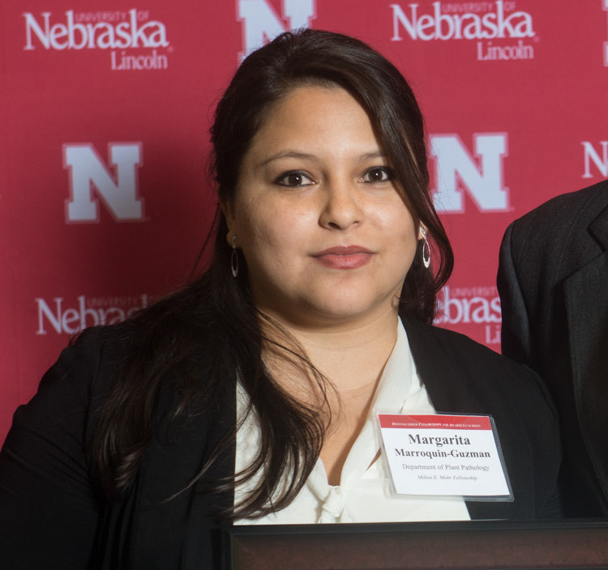
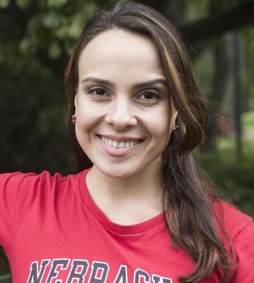
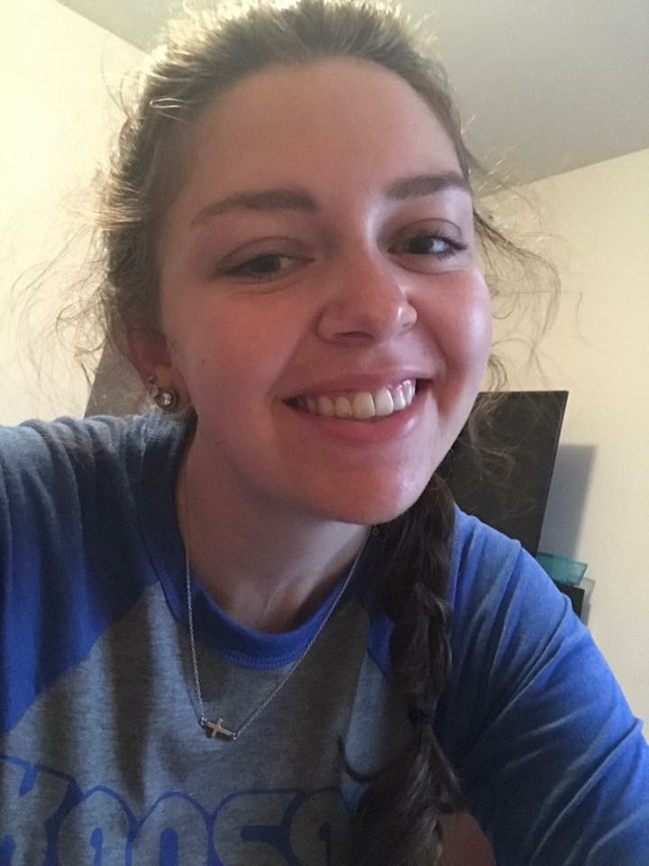

 
{.custom_circle .grow}

### PI and Lab manager

- <a href="sydney-everhart.html"> Sydney Everhart</a>, Ph.D.

 

{.custom_circle .grow}

### Research Technologist

- Rebecca Higgins, October 2018 to **present**. 

    Becky is responsible for the *Sclerotinia sclerotiorum* bean line evaluation research and maintains the culture collection.

 

{.custom_circle .grow}

### Postdoctoral Scholars

- Margarita Marroquin-Guzman, Ph.D., June 2017 to **present**. 

    Margarita is currently working on the meta-community analysis of the microbial communities associated with different cover crops in Nebraska. This research aims to improve our understanding of whether cover crops are serving as a green bridge for detrimental/beneficial microbes in the soil.

 

### Graduate Students

{.custom_circle .grow}

- <a href="https://plantpathology.unl.edu/nikita-gambhir"> Nikita Gambhir</a>, Doctoral student, August 2015 to **present**. 

    Nikita's doctoral research is in genome analysis of *S. sclerotiorum* mutational lines to improve our understanding of the microscale evolution of this pathogen. She is also characterizing the population structure and fungicide sensitivity *Rhizoctonia zeae* that she has collected from Nebraska.

{.custom_circle .grow}

- <a href="https://www.researchgate.net/profile/Edgar_Nieto_Lopez2"> Edgar H. Nieto-Lopez</a>, Doctoral student, August 2016 to **present**. 

    Edgar is conducting a project to assess fungicide sensitivity and population structure of *S. sclerotiorum* from soybean, potato, and dry bean in the North Central States and Mexico. This is much needed work to improve our understanding of the "hidden epidemiology" of this pathogen.

{.custom_circle .grow}

- Karen Ferreira Da Silva, Doctoral student, June 2018 to **present**.

    Karen's research is focused on improving our understanding of the *Clavibacter michigainensis* pv. *nebraskensis* interaction with the fall armyworm on corn. She will also conduct a meta-analysis of previous *S. sclerotiorum* population genetic studies. Complementary to her scientific inquiries, she also aims to assess leadership needs and training of graduate students in the agSTEM sciences across the United States, to increase professional skill development in our students.

- Julianne Matczyszyn, Doctoral student, December 2019 to August 2019.

    Julianne is conducting a project on the ecology and evolution of plant parasitic nematodes. She started her graduate degree in the lab of Tom Powers and, having taken on more and complex data analyses for her projects, joined the Everhart Lab for completion of her dissertation. She completed her dissertation and successfully defended in July of 2019. Congratulations, Julianne!

- Srikanth Kodati, Doctoral student, April 2019 to **present**.
 
     Srikanth is a doctoral student focused on characterizing the etiology, pathogenicity, and aggressiveness of Rhizoctonia-like fungi in Nebraska, including crop fields and the Sandhills Grassland of Nebraska. His projects were initiated while working in the lab of Dr. Tony Adesemoye, who recently left for an industry position. Srikanth is expected to graduate in December of 2019. Prior to joining UNL, Sri received his master's degree studying powdery mildew of dogwood from Tennessee State University.
  

- Asha Mane, Doctoral student, August 2019 to **present**.
  
     Asha came to UNL is 2018 with a master's from the University of Pune and has several years of experience in molecular laboratory techniques. She is currently working to decide on projects that she will conduct for completion of her Ph.D.
  

- Sergio Gabriel-Peralta, Doctoral student, August 2019 to **present**.
     Sergio received funding to support his graduate studies from the CONNACYT Mexican government. Prior to that, he received his master's from UNL studying viruses under the direction of Dr. Hernan Garcia-Ruiz. Sergio's projects in my lab will focus on both *Sclerotinia sclerotiorum* and *Gemmamyces picea*.

{.custom_circle .grow}

### Undergraduate Lab Assistants

- Rachel Persson, undergraduate in Biochemistry, May 2018 to **present**. 

    Rachel received competitive research funding from the UNL UCARE program. Her research is focused on development of a set of DNA standards for *S. sclerotiorum* genotyping studies to enable data from previous published studies to be combined.
    
- Olivia Renelt, undergraduate in Biochemistry, November 2018 to **present**.

- Cristian Wolkup-Gil, undergraduate in Biochemistry, January 2019 to **present**.
   
    Cristian wrote and received both the UCARE award and the IANR undergraduate research award, which will support his project for the summer and following academic year.
  

 

---

 

### Past Members 

*Listed in reverse chronological order:*

- **Audrey Vega**, lab assistant and Biological Systems Engineering Major, Nov. 2017 to May 2018

{.custom_circlesm .grow}

- **Isabel Chavez**, lab assistant and undergraduate in Biological Systems Engineering Major, November 2017 to May 2018

{.custom_circlesm .grow}

- **Zhian N. Kamvar**, *Postdoctoral Scholar* January 2017 to April 2018. Zhian is now working with Thiabaut Jombart in the UK.

- **Thomas J. J. Miorini**, *Postdoctoral Scholar* April 2016 to April 2017; January 2018 to April 2018. Thomas is now working with Dr. Michael Wunsch at North Dakota State University.

- **Alex N. Johnson**, *Lab Assistant* July 2017 to January 2018. Alex will be attending medical school this fall.

- **Jimin Kamvar**, *Digital Communications Liaison* and content manager for UNL Department of Plant Pathology website, September to December, 2017.

- **Anthony Pannullo**, undergraduate in Biological Sciences and former lab assistant / honors thesis student from March 2016 to July 2017.  Anthony is now a graduate student in the microbiology program at the University of Iowa.

- **Morgan Thompsen**, undergraduate in Biological Sciences and former lab assistant from March 2016 to December 2016.

- **Josh Hanson**, undergraduate in Biological Systems Engineering and former lab assistant from September 2014 to December 2016.

- **B. Sajeewa Amaradasa**, postdoctoral scholar from August 2014 to July 2016 and now a postdoc with Nick DuFault at the University of Florida

- **Sarah Campbell**, undergraduate in Biological Sciences and former lab assistant from September 2014 to May 2016. Sarah is now a graduate student in the Department of Plant Pathology at the University of Georgia, co-supervised by Drs. Phil Brannen and Harald Scherm.

- **Flavio Nunes Da Silva**, Agronomic Engineering major at Federal University of Sao Carlos, Araras, Brazil and lab intern during the summer of 2015 as part of the Brazil Scientific Mobility "Science without Borders" Program.

 

### Collaborators

*Active research collaborators*

- Guido Schnable, Clemson University

- Jim Steadman, University of Nebraska

- Anthony Adesemoye, University of Nebraska WCREC

- Amauri Bogo, Universidade do Estado de Santa Catarina, Brazil

- Gerard Adams, University of Nebraska

- Denita Hadziabdic-Guerry, University of Tennessee
