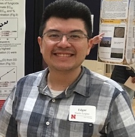

 
{.custom_circle .grow}

### PI and Lab manager

- <a href="sydney-everhart.html"> Sydney Everhart</a>, Ph.D.

 

### Postdoctoral Scholars

{.custom_circle .grow}

- <a href="https://plantpathology.unl.edu/thomas-justo-miorini">Thomas J.J. Miorini</a>, Ph.D., April 2016 to April 2017; January 2018 to **present**

{.custom_circle .grow fig.cap="Zhian"}

- <a href="https://zkamvar.github.io/"> Zhian N. Kamvar</a>, Ph.D., Jan. 2017 to **present**

{.custom_circle .grow}

- Margarita Marroquin-Guzman, Ph.D., June 2017 to **present**

 

### Graduate Assistants

- <a href="https://plantpathology.unl.edu/nikita-gambhir"> Nikita Gambhir</a>, Doctoral student, August 2015 to **present**

{.custom_circle .grow}

- <a href="https://www.researchgate.net/profile/Edgar_Nieto_Lopez2"> Edgar H. Nieto-Lopez</a>, Doctoral student, August 2016 to **present**

{.custom_circle .grow}

 

### Undergrad Assistants

- Audrey Vega, Biological Systems Engineering Major, Nov. 2017 to **present**

- Isabel Chavez, Biological Systems Engineering Major, Nov. 2017 to **present**

 
 

---

### Past Members 

*Listed in reverse chronological order:*

- **Alex N. Johnson**, *Lab Assistant* July 2017 to January 2018. Alex will be attending medical school this fall.

- **Jimin Kamvar**, *Digital Communications Liaison* and content manager for UNL Department of Plant Pathology website, September to December, 2017.

- **Anthony Pannullo**, undergraduate in Biological Sciences and former lab assistant / honors thesis student from March 2016 to July 2017.  Anthony is now a graduate student in the microbiology program at the University of Iowa.

- **Morgan Thompsen**, undergraduate in Biological Sciences and former lab assistant from March 2016 to December 2016.

- **Josh Hanson**, undergraduate in Biological Systems Engineering and former lab assistant from September 2014 to December 2016.

- **B. Sajeewa Amaradasa**, postdoctoral scholar from August 2014 to July 2016 and now a postdoc with Nick DuFault at the University of Florida

- **Sarah Campbell**, undergraduate in Biological Sciences and former lab assistant from September 2014 to May 2016. Sarah is now a graduate student in the Department of Plant Pathology at the University of Georgia, co-supervised by Drs. Phil Brannen and Harald Scherm.

- **Flavio Nunes Da Silva**, Agronomic Engineering major at Federal University of Sao Carlos, Araras, Brazil and lab intern during the summer of 2015 as part of the Brazil Scientific Mobility "Science without Borders" Program.

 

### Collaborators

*Active research collaborators*

- Guido Schnable, Clemson University

- Jim Steadman, University of Nebraska

- Anthony Adesemoye, University of Nebraska WCREC

- Amauri Bogo, Universidade do Estado de Santa Catarina, Brazil

- Gerard Adams, University of Nebraska

- Denita Hadziabdic-Guerry, University of Tennessee
