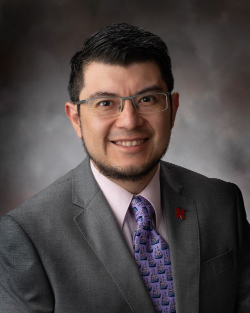
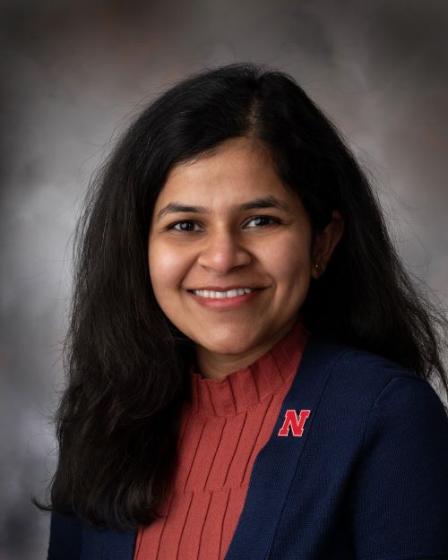
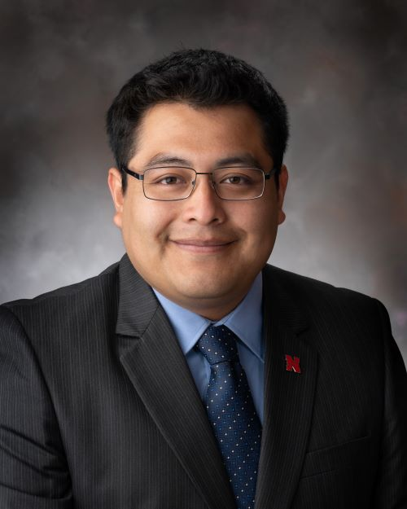

 
{.custom_circle .grow}

### PI and Lab manager

- <a href="sydney-everhart.html"> Sydney Everhart</a>, Ph.D.

 

{.custom_circle .grow}

### Research Technologist

- Rebecca Higgins, October 2018 to **present**. 

    Becky is responsible for the *Sclerotinia sclerotiorum* bean line evaluation research and maintains the culture collection.

 

### Postdoctoral Scholars

- *New person coming soon!*

 

### Graduate Students

{.custom_circle .grow}

- <a href="https://www.researchgate.net/profile/Edgar_Nieto_Lopez2"> Edgar H. Nieto-Lopez</a>, Doctoral student, August 2016 to **present**. 

    Edgar is conducting a project to assess fungicide sensitivity and population structure of *S. sclerotiorum* from soybean, potato, and dry bean in the North Central States and Mexico. This is much needed work to improve our understanding of the "hidden epidemiology" of this pathogen.

{.custom_circle .grow}

- Asha Mane, Doctoral student, August 2019 to **present**.
  
     Asha came to UNL is 2018 with a master's from the University of Pune and has several years of experience in molecular laboratory techniques. She is currently working to decide on projects that she will conduct for completion of her Ph.D.
  

{.custom_circle .grow}

- Sergio Gabriel-Peralta, Doctoral student, August 2019 to **present**.
     Sergio received funding to support his graduate studies from the CONNACYT Mexican government. Prior to that, he received his master's from UNL studying viruses under the direction of Dr. Hernan Garcia-Ruiz. Sergio's projects in my lab will focus on both *Sclerotinia sclerotiorum* and *Gemmamyces picea*.

- *New person coming soon!*

### Undergraduate Lab Assistants

- *New person coming soon!*
  

 

---

 

### Past Members 

*Listed in reverse chronological order:*

- **Nikita Gambhir**, *PhD graduate December 2020*. Nikita is now a postdoctoral scholar at Cornell University in Geneva, NY.

- **Cristian Wolkup-Gil**, UCARE project and Biochemistry maor, January 2019 to August 2020. Cristian is now a PhD student at the Scripps Research Institute in California.

- **Karen Ferreira Da Silva**, *PhD graduate May 2020*. Karen is now an Integrated Field Scientist / Plant Pathologist for Corteva Agriscience in Sacramento, CA.

- **Margarita Marroquin-Guzman**, *Postdoctoral Scholar* June 2017 to July 2018. Margarita is now a Plant Pathologist for Bayer Crop Science in St. Louis, MO.

- **Srikanth Kodati**, *PhD graduate December 2019*. Srikanth is now a postdoctoral scholar at Valley Laboratory that is part of the Connecticut Research Station in Windsor, CT.

{.custom_circle .grow}

- **Julianne Matczyszyn**, *PhD graduate August 2019*. Julianne is a lab manager at UNL in the Agronomy & Horticulture department.

- **Rachel Persson**, UCARE project and Biochemistry major, May 2018 to August 2019. Rachel went on to attend dental school after graduation.

- **Olivia Renelt**, lab assistant and Biochemistry major, January 2019 to August 2019.

- **Audrey Vega**, lab assistant and Biological Systems Engineering Major, Nov. 2017 to May 2018.

{.custom_circlesm .grow}

- **Isabel Chavez**, lab assistant and undergraduate in Biological Systems Engineering Major, November 2017 to May 2018

{.custom_circlesm .grow}

- **Zhian N. Kamvar**, *Postdoctoral Scholar* January 2017 to April 2018. Zhian is now working with Thiabaut Jombart in the UK.

- **Thomas J. J. Miorini**, *Postdoctoral Scholar* April 2016 to April 2017; January 2018 to April 2018. Thomas is now working with Dr. Michael Wunsch at North Dakota State University.

- **Alex N. Johnson**, *Lab Assistant* July 2017 to January 2018. Alex will be attending medical school this fall.

- **Jimin Kamvar**, *Digital Communications Liaison* and content manager for UNL Department of Plant Pathology website, September to December, 2017.

- **Anthony Pannullo**, undergraduate in Biological Sciences and former lab assistant / honors thesis student from March 2016 to July 2017.  Anthony is now a graduate student in the microbiology program at the University of Iowa.

- **Morgan Thompsen**, undergraduate in Biological Sciences and former lab assistant from March 2016 to December 2016.

- **Josh Hanson**, undergraduate in Biological Systems Engineering and former lab assistant from September 2014 to December 2016.

- **B. Sajeewa Amaradasa**, postdoctoral scholar from August 2014 to July 2016 and now a postdoc with Nick DuFault at the University of Florida

- **Sarah Campbell**, undergraduate in Biological Sciences and former lab assistant from September 2014 to May 2016. Sarah is now a graduate student in the Department of Plant Pathology at the University of Georgia, co-supervised by Drs. Phil Brannen and Harald Scherm.

- **Flavio Nunes Da Silva**, Agronomic Engineering major at Federal University of Sao Carlos, Araras, Brazil and lab intern during the summer of 2015 as part of the Brazil Scientific Mobility "Science without Borders" Program.

 

### Collaborators

*Active research collaborators*

- Guido Schnable, Clemson University

- Jim Steadman, University of Nebraska

- Anthony Adesemoye, University of Nebraska WCREC

- Amauri Bogo, Universidade do Estado de Santa Catarina, Brazil

- Gerard Adams, University of Nebraska

- Denita Hadziabdic-Guerry, University of Tennessee
