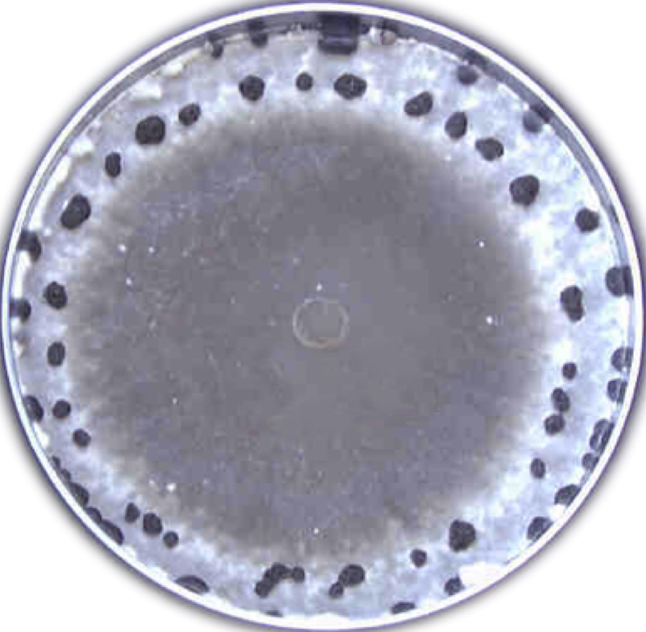
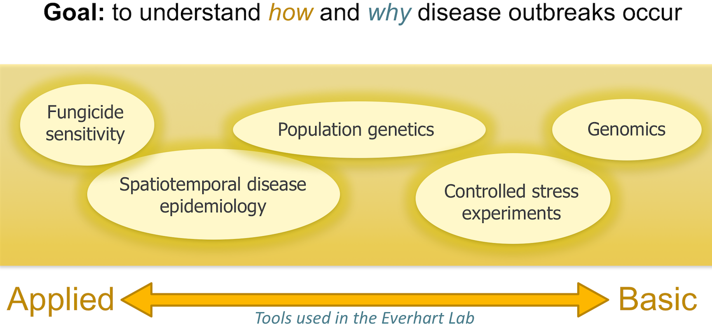
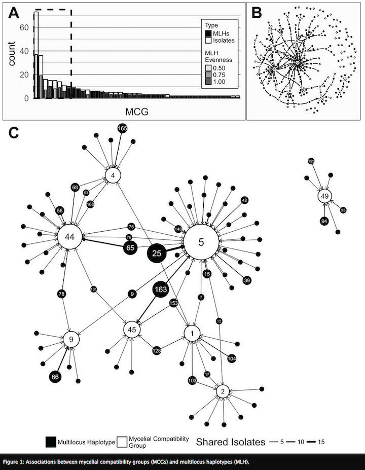
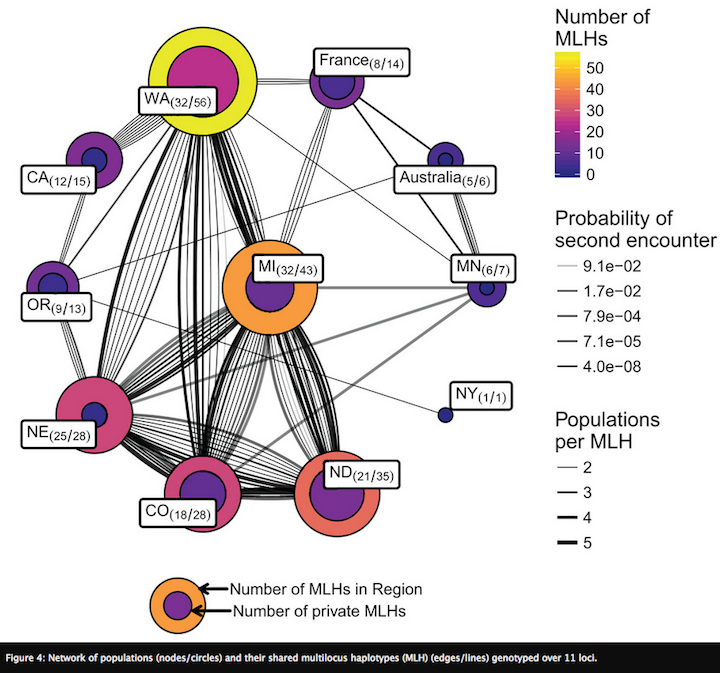
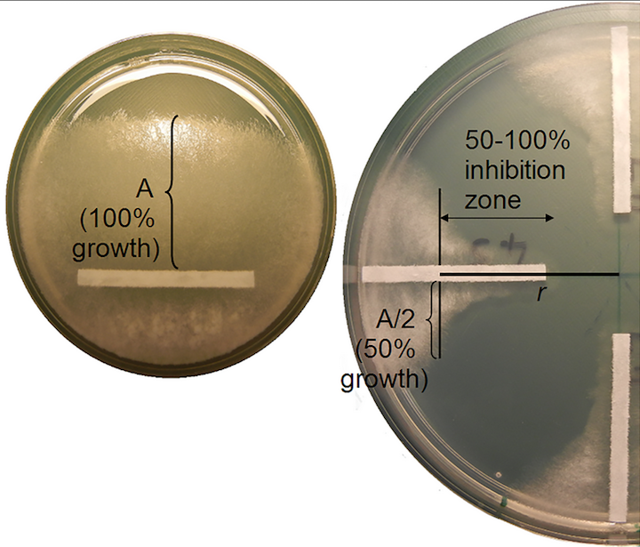
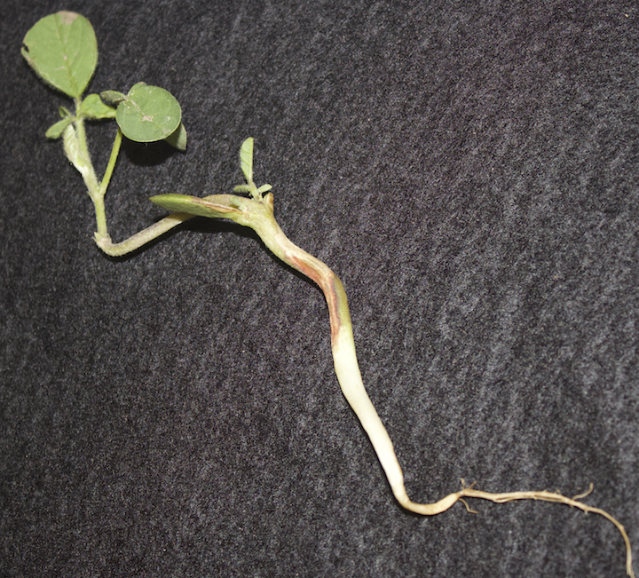

{.custom_circle2 .shadow}

In the Everhart lab, our overarching goal is to understand how and why disease outbreaks occur.  Using molecular and quantitative data analysis approaches, we seek to determine factors that may be predictive of disease outbreaks.  Such factors may involve aspects of the host (cultivar or species affected), management technique (crop rotation, tilling, or pesticide applications), environment (local temperatures, rainfall/irrigation, soil type), pathogen phenotype (aggressiveness, fungicide sensitivity, growth rate), or biology of the pathogen (mechanisms of spread, sexual recombination). Basic knowledge of these factors enable efficient disease management decisions.

 
 

{.custom_span}

 

#### *Pathogens we study*
Active research in the Everhart lab is focused on several fungal pathogens that cause disease in Nebraska, including *Sclerotinia sclerotiorum*, *Rhizoctonia solani*, and *Fusarium virguliforme* (current name *Neocosmopara virguliforme*), which cause disease several economically important crops, such as soybean, corn, and dry bean.  Collaborative projects are also underway in my lab to apply quantitative molecular epidemiological approaches to gain knowledge of several economically important fungal pathogens, such as the spruce bud blight pathogen *Gemmamyces picea*, causal agent of thousand cankers disease *Geosmithia morbida*, and the cacao pod rot pathogen *Monoliophthora rorei*.  

----

## Current Research Areas

### Landscape genetics
#### *Disentangling complex factors shaping populations – *

[{.custom_image .shadow .grow}](https://peerj.com/articles/4152/)

[{.custom_image .shadow .grow}](https://peerj.com/articles/4152/)

Current work in my lab is examining the landscape genetics of *Sclerotinia sclerotiorum* from dry bean across the U.S. [@kamvar2017population]. Since multi-site screening nurseries are used to identify dry bean lines with increased resistance to white mold, our work sought to determine whether pathogen populations within nurseries were genotypically and phenotypically representative of producer fields across the dry bean producing region of the U.S. We genotyped 366 isolates from states that collectively produce more than 85% of dry beans and were collected across 10 years from multi-site screening nurseries and nearby producer fields. Phenotypic traits, such as pathogen aggressiveness and mycelial compatibility group, were also determined. Since none of the typical multivariate methods used in population genetic analyses were capable of identifying factors underlying patterns of genetic variation, I adapted a method from community ecology, called distance based redundancy analysis (dbRDA). This method was able to simultaneously evaluate environmental, phenotypic, host, and temporal variation to identify variables most likely to be connecting and driving pathogen spread. 

An unexpected pattern in our data was that Mexican populations had greater genetic diversification from the U.S. than did populations from different continents (France and Australia). One hypothesis is that increased diversity arises in subtropical environments, which allow for more cycles of sexual reproduction and outcrossing. To test this, projects are underway in my lab to characterize populations of *S. sclerotiorum* from Mexico and compare them to populations from soybean across the North Central U.S., (conducted by Ph.D. student from Mexico, Edgar Nieto Lopez). We are also characterizing populations in subtropical regions of Brazil to capture continental-level structure.This is a project recently completed by Anthony Pannullo for his undergraduate honors thesis, which is currently in preparation for submission to *Phytopathology* (Pannullo et al. *In prep*). 

 

### Emergence of genetic variation
#### *Abiotic stress as mechanism for diversity - *

[{.custom_image .shadow .grow}](http://journals.plos.org/plosone/article?id=10.1371/journal.pone.0168079)

Another hypothesis for increased diversity is that non-lethal fungicide exposure causes oxidative stress that increases mutation rates and genetic diversity within pathogen populations [@schnabel2014studies; @chen2015fungicide; @dowling2016effect]. To test this hypothesis in *S. sclerotiorum*, we performed a lab study that showed *in vitro* fungicide exposure increased mutation rates at microsatellite loci and in AFLP profiles [@amaradasa2016effects]. Currently, we are performing genome sequencing to fully characterize the fungicide-exposed isolates (analysis underway by graduate student, Nikita Gambhir, in collaboration with postdoc, Dr. Zhian Kamvar). We have also obtained populations of *S. sclerotiorum* from field plots treated with different fungicides to evaluate if genetic diversity is related to fungicide application or range of fungicide sensitivity within treated plots. This project is being conducted by graduate student, Edgar Nieto-Lopez and is funded by the North Central Soybean Research Program. Collectively, these studies are important for understanding the landscape-scale population genetic structure   of *S. sclerotiorum* across the United States and elucidate mechanisms that may drive diversification and spread of this economically important plant pathogen. 

 

### Community sequencing
#### *Using community sequencing to identify drivers of disease – *
It is not always possible to use population tools to address emerging disease issues. For example, re-planting after a cover crop in Nebraska is causing yield loss, possibly due to allelopathic or green bridge effects, which are poorly understood. To address this, my lab is using metabarcoding to characterize the effects of these practices on soil microbial communities. Multivariate methods, such as network analysis, multidimensional scaling, and indicator species analysis, will enable us to synthesize information at the systems-level and identify positive and negative drivers of disease and yield, which will be valuable for management recommendations. This is funded in 2017 by the USDA, with metabarcoding underway by the postdoc in my lab, Dr. Margarita Marroquin-Guzman. 

 

### Quantifying pathogens in soil
#### *Using culturing to characterize* Rhizoctonia solani *in Nebraska and the North Central U.S. - *

{.custom_image .shadow .grow}

Among all types of diseases in Nebraska, yield loss due to seedling diseases ranked third in 2011. *Rhizoctonia solani* is one of three pathogens most commonly associated with seedling disease, where fungicide seed treatments are the recommended line of defense. However, fungicide resistance in *R. solani* may be a new threat to this protection. A major problem is that by the time that fungicide resistance is detected by growers, it may be too late to prevent spread of fungicide resistance. This problem is compounded by a lack of knowledge of the structure of pathogen populations within fields, which directly limits our ability to design targeted and effective disease management strategies.  Beginning in 2015, our research (in collaboration with Dr. Tony Adesemoye's lab at the UNL WCREC) has performed a comprehensive sampling of *R. solani* from soybean fields in Nebraska to determine sensitivity of isolates to commercial fungicides with different modes of action and to characterize the structure of pathogen populations within and between fields. This work is being conducted by graduate student, Nikita Gambhir.

 

## References Cited