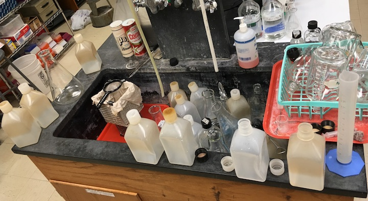
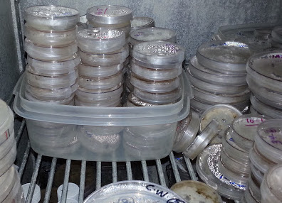
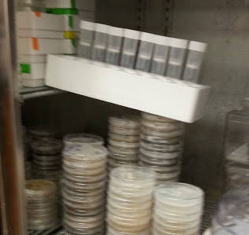
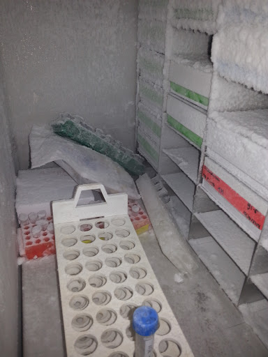
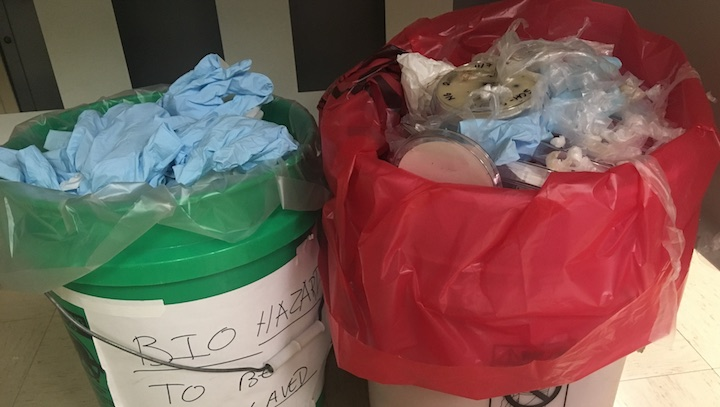
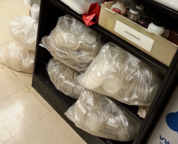

/ˈstü-ərd-ˌSHip/

**Definition**: the job of supervising or taking care of something, such as an organization or property. 

---

## What is good lab stewardship?
Good lab stewardship is the practice of taking care of the lab and work space. This ensures that all members of the lab are able to work effectively in the same space to accomplish their objectives on a daily basis. Good lab stewardship facilitates cooperation and respect for one another. Below are a set of good lab stwardship practices that I recommend in order to ensure our space is always able to be used effectively. 

On a few rare occasions, poor lab stewardship has been observed in our lab.  These cases are documented below as reminders of what *not* to do, with explanations as to why you shouldn't do this.

 

### On Dishes

Always make sure to clean your dishes after a project. When you are planning an experiment, good lab stweardship means you've planned time to do the dishes too. Running out of time before classes or having conducted a time-consumiming project are not an excuse for not cleaning your dishes. Leaving dirty dishes in the sink prevents other people from being able to use it. 

 
 

### On Storage 

 

#### Storing Petri plates

Label and store your cultures in a way that makes it easy to know who owns them and what they are. It is best to store all of your culture inside ventilated plastic boxes and to use tape on the outside of the box to clearly label the contents and indicate the owner. Poorly labeled or stored plates are problematic. Stacks of plates that are not inside boxes are likely going to be knocked over.

Keep your culture plates inside clean plastic boxes to prevent a spill, let us know who the owner is, and to reduce the spread of mites if a contamination occurs. Mites can easily spread from plate-to-plate when they're not inside boxes or parafilmed. However, parafilm alone is not enough. Parafilm wrapped around plates will slow mites down, but not stop them from getting into your plates and spreading bacteria. It also makes it much more difficult to deter mite contamination of cultures. 

Macroscopic symptoms of mite contamination include: tracks or trails through condensation that has formed on the lid of the Petri plate, aerial mycelium eaten away to the surface of the agar, and bacterial contamination appearing in the plate. Microscopic investigation of plates with the dissecting microscope will allow you to see the tiny, transluscent, 8-legged pests on the mycelium. If you find or suspect mites, notify me and your lab mates immediately so we can begin the triage process and limit further spread.

 

#### How to store your items

Always store your items in a safe way that keeps things organized and prevents accidents. Storing items precariously means they can be easily knocked over, possibly destroying the contents, contaminating storage containers, and creating a mess.  For example, in the photo at the right, there were no labels on these tubes, so for all I know they contain some toxic or hazardous substance. Although this may be the "quick and easy" way to store some items, it does not follow the lab safety protocols and could be dangerious to your lab mates. Always plan in time to keep your items organize, labeled, and stowed properly. 

 

#### Storage in the -80C freezer

Store all of your items inside labeled white boxes, placed into the metal shelving that is inside the freezer. Mark the white box before you put it inside the freezer (markers cannot write on frozen boxes). If you know you'll be filling several boxes, take time to label one of the metal racks as yours so that all of your boxes are neatly organized in one place. 

For larger items that cannot fit inside boxes, we have one shelf inside the freezer for these items. All other items that can fit inside a box need to be stored that way and properly labeled (owner, date, contents). 

Any USDA-APHIS regulated cultures stored in the -80C must be labeled accordingly and added to the inventory list that is located on the exterior of the freezer door.

 

### On Biohazard Waste

  

#### Empty the bin when full

Once a biohazard bag is full, you are responsible for taking care of the trash. Remove the bag and contents from the bucket, close the bag with a twist tie (make sure to leave air gap), and place the bag onto a tray in preparation to be autoclaved. Place a new liner into the trash bin. Do not leave the biohazard bins full for the next person to clean up after you. This is an annoyance and also makes a place where spore-bearing cultures can proliferate and serve to contaminate the rest of the cultures in our lab. 

 

#### Autoclave the waste too

If you are the person who emptied the waste bin, you are also responsible for autoclaving and disposing the waste. However, it's not always practical or possible to autoclave a single bag of waste, since the autoclaves are sometimes in full use. Also, our autoclave can fit more than one bag, so to make best use of resources, it may be necessary to stow the tray with closed bag and wait until another bag is full before loading them into the autoclave. 

These bags should not accumulate unnecessarily. If you accumulate a large number of bags from a single project and need to wait more than 1-hour to place them in the autoclave, leave a message with your name on the bags and indicate when they will be properly disposed. There have been cases where large numbers of bags accumulated and no one too responsibility for autoclaving them. Be considerate of your lab mates and help take care of the trash.

 

#### Disposing of autoclaved waste

Once bags have been autoclaved and cooled (solidified), the bags can be placed into the regular trash bin that has a black bag liner. There is one large trash container in our lab like this by the main entrance. Only autoclaved biohazard waste can be placed in this container. Once it is full, close the black plastic bag so that the custodial staff know for certain that contents are intended for the dumpster. If this container is full and you have more trash to add, do your custodial staff person a favor and take the trash to the dumpster. This kindness to our staff is the kind of respect they deserve.