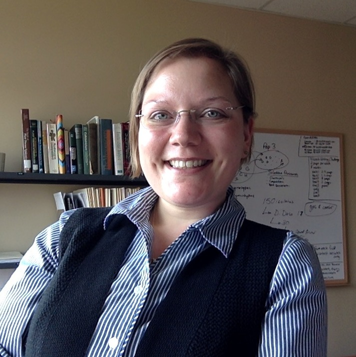
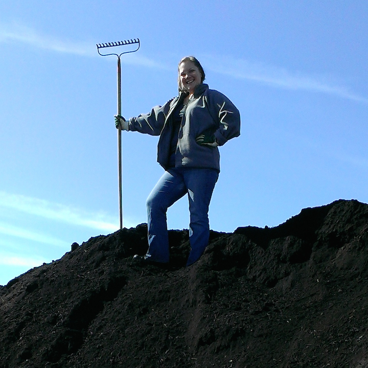

## Assistant Professor and Quantitative Ecologist
#### 80% Research / 20% Teaching  [<a href="documents/Everhart_CV.pdf">CV</a>]

 

### Research Interests
My research interests are to better understand how and why disease outbreaks occur.  This is a fundamental question that I strive to answer using epidemiology, population genetics/genomics, and experimental approaches.  For example, quantifying symptoms and patterns of disease is a first step towards identifying mechanisms of disease spread.  Subsequently, the use of molecular genetic markers for the pathogen can enable deeper inference of sources of the pathogen within the cropping system.  Finally, experimental approaches are useful, and in my opinion, underutilized, to better characterize modes of spread and mechanisms of evolution.

 

### Teaching Responsibilities
In teaching, I am responsible for one of the department's required graduate courses, offered every spring, PLPT 802: Ecology & Management of Plant Pathogens.  I also teach a course in my area of expertise every-other-year, PLPT 892: Epidemiology & Population Genetics, which will be offered in fall 2018.  Routinely, I offer workshops to introduce scientists to R.  

 

### Other Interests
Aside from research and teaching, I am passionate about being an advocate for women and minorities in science.  I've recently partnered with faculty in Engineering and Agronomy & Horticulture departments to create a mentoring program for women and minority youth from rural towns in Nebraska, supported by a grant from the USDA Woman Minority in Agriculture. 

 

### Personal
When not doing science, I can either be found gardening or mountain biking the paths and trails of Lincoln.

 

