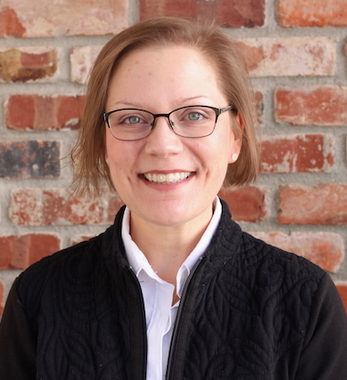

{.custom_circle .grow}

#### Associate Professor and Quantitative Ecologist
#### 80% Research / 20% Teaching  [<a href="documents/Everhart_CV.pdf">CV</a>]
#### Open access to [<a href="documents/Everhart_PnT_Dossier_12-21-2018.pdf">my application for promotion and tenure</a>]

 

### Research Interests
My research interests are to improve our understanding of how and why disease outbreaks occur.  This is a question I strive to answer using epidemiology, population genetics/genomics, and experimental approaches.    For example, quantifying symptoms and patterns of disease is a first step towards identifying mechanisms of disease spread.  Subsequently, the use of molecular genetic markers for the pathogen can enable deeper inference of sources of the pathogen within the cropping system.  Finally, experimental approaches are useful, and in my opinion, underutilized, to better characterize modes of spread and mechanisms of evolution.

 

### Background
My background is in quantitative epidemiology and population genetics / genomics. My Ph.D. work utilized a 3-dimensional approach to characterize the spatial pattern of brown rot disease epidemics within peach tree canopies and developed molecular tools to examine the corresponding pathogen population. As a USDA-AFRI-NIFA postdoctoral fellow at Oregon State University, I utilized whole-genome sequencing and Genotyping-by-Sequencing to examine population variation in *Phytophthora ramorum*, causal agent of Sudden Oak Death. 

 

### Teaching Responsibilities
In teaching, I am responsible for one of the department's required graduate courses, offered every spring, PLPT 802: Ecology & Management of Plant Pathogens.  I also teach a course in my area of expertise every-other-year. In the past, I taught a special topics course called *Epidemiology & Population Genetics*, and currently teach a professional development course called *Success in the Sciences*.  Routinely, I offer workshops to introduce scientists to R at local, regional, and national meetings.

 

### Other Interests
Aside from research and teaching, I am passionate about being an advocate for women and minorities in science.  I've recently partnered with faculty in Engineering and Agronomy & Horticulture departments to create a mentoring program for women and minority youth from rural towns in Nebraska, supported by a grant from the USDA Women and Minorities in Science, Technology, Engineering, and Mathematics Fields Grant Program (WAMS). 

 

### Personal

{.custom_image .shadow .grow}

When not doing science, I enjoy activities that take me outdoors. My hobbies include gardening and collecting unusual or visually striking plants. I also enjoy mountain biking the numerous paths and trails of Lincoln and try to ride to work on a daily basis, even through ice and snow (studded tires are a must through winters in the midwest!). As an alumnus of the University of Iowa, I also enjoy going to one or two Hawkeye football games per year with my dad and sister, who still reside in Iowa.
